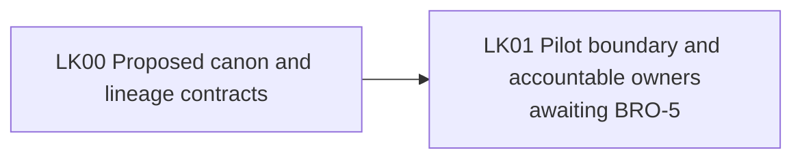

# Living Knowledge architecture: current state

**Evidence base:** merged [contract PR #1](https://github.com/brock-run/living-knowledge/pull/1) and [architecture PR #2](https://github.com/brock-run/living-knowledge/pull/2), 2026-10-03. This repository contains proposed contracts and lineage design, **no application implementation**. [Component map](component-map.md) lists the next decision gate and planned nodes.

The contracts describe steward-approved domain knowledge, source evidence, effective time, context-filtered retrieval, publication pins, and reverse impact. They do not yet create a package, approved assertion, index, API, or OpenLineage event. The first real source and permitted audience depend on the product owner's BRO-5 inputs. No target diagram node should be read as deployed or as a decision to choose Iceberg, Prefect, or a particular hosted stack.
