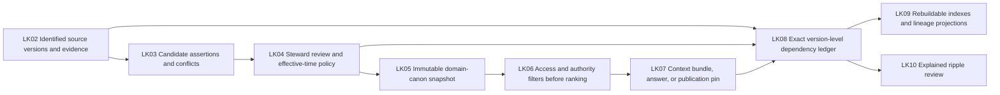

# Living Knowledge architecture: target state

**Status:** proposed domain-knowledge architecture. [Current state](current-state.md) is design-only. The [component map](component-map.md) ties each target node to its source and first decision gate.

PKM Canon can supply source-faithful versions, but Living Knowledge alone decides which domain assertions are approved. Candidate research is a labeled reviewer mode. An answer uses a named canon, permitted audience and purpose, access, and effective time before relevance ranking; its pin records exact claims and evidence actually used. A historical pin remains auditable but does not grant a new reader access.

The dependency ledger is the governing version-level record for ripple. SQL views, search indexes, and OpenLineage/PROV-O mappings are projections that can be rebuilt and reconciled after lag. Storage and orchestration choices remain contingent on the bounded pilot and operational spike; no target box implies an accepted implementation decision.
