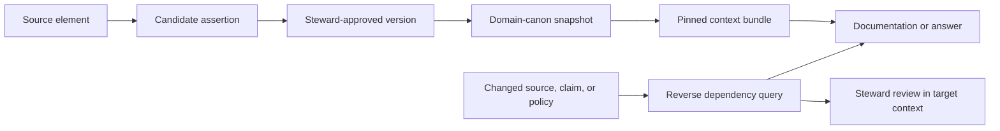

# Provenance, lineage, and ripple in Living Knowledge

**Status:** Proposed architecture. This repository does not yet implement the
dependency ledger, OpenLineage emission, or ripple queries.

**Portfolio decision:** [Named canons](https://app.notion.com/p/3ea899c28af38140907bd5c4a34a059d)
and [provenance, lineage, and ripple](https://app.notion.com/p/3ea899c28af381d8a16ffe236e8d5a93)
in Canonworks.

## Shared decision

**Provenance** records an object's origin, transformation, and responsible
actors. **Lineage** records durable dependencies between versions, runs, and
outputs. **Ripple** traverses those dependencies backward from a change,
compares the relevant snapshots, and asks the product's policy what needs
review.

The terms answer different questions: “Where did this assertion come from?”,
“What depends on it?”, and “What action is warranted after it changes?” The
[canon contract design](canon-semantics-and-contracts.md) keeps them aligned
with Rosetta and CanonFlow while Living retains steward approval, effective
time, and access policy.

## Living Knowledge application

- **Provenance:** for each assertion or knowledge-object version, retain source
  version and excerpt, extraction/reconciliation activity, reviewer and
  decision, policy version, observation time, and effective interval. A source
  passage remains evidence even when its proposed claim is rejected.
- **Lineage:** record exact `source element → candidate assertion → approved
  assertion version → knowledge object → context bundle/documentation/answer`
  edges. Link index and table snapshots to the runs and versions that built
  them. Edge types distinguish support, derivation, citation, and selection.
- **Ripple:** when source evidence, an approved claim, policy, or effective
  interval changes, reverse-traverse version-level edges, compare with the
  target domain-canon snapshot, and route affected objects or publications
  to a steward. A historical answer may remain valid for its pinned effective
  time and audience; a new request must apply current authority and access.

## OpenLineage and PROV-O

[OpenLineage's object model](https://openlineage.io/docs/spec/object-model/)
fits durable ingestion, assertion extraction, Iceberg table writes, index
builds, and context-bundle build runs. Its Job, Run, Dataset, and dataset-version
information explains pipeline movement. Emit it from durable events or an
outbox. Keep an internal exact dependency ledger for the assertion and
publication links needed by ripple; a dataset-level edge alone cannot show
which assertion supported one answer.

[W3C PROV-O](https://www.w3.org/TR/prov-o/) supplies Entity, Activity, Agent,
and derivation vocabulary. Map Living's source and assertion versions to
Entities, extraction and review to Activities, and stewards/services to Agents.
These mappings improve interchange; the governing record remains Living's
audited claim, review, snapshot, and dependency data.

## Contract checks to add with implementation

1. An approved assertion resolves to source evidence, reviewer decision,
   policy version, and effective interval; a candidate is never served as
   approved without an explicit reviewer mode.
2. A documentation release or context bundle pins its actual claim/evidence
   versions and the canon snapshot used.
3. Reverse impact returns exact paths with context and distinguishes actual
   use from a broad table-snapshot overlap.
4. OpenLineage event delivery is reconciled against durable local events, and
   access is rechecked before serving historical evidence or pins.
